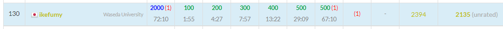

## 結果

US配列で参加する二回目のコンテスト。まだタイピングがおぼつかなくて、`=`を入力したかったのに`_`を入力してしまったり、`*`の位置が分からなくなったりする。

久々の三桁順位で萎えた。

[コンテストのURL](https://atcoder.jp/contests/abc290)

## 振り返り

### A
やるだけ。指の体操

### B
`K-- > 0`で判定すると楽な気がする。

### C
最初は$A$をソートしたり`unique`したりしようとしてたけど、set使った方が楽なのでそっちに変更して書いた。

### D
予選仕様なだけあってちょっとむずい気がしたけどqual Aよりはマシな難易度してた気がする。qual AのDは解法思い浮かぶまで時間かかったけどこれはすぐ浮かんだので。問題文を理解するのにちょっと時間がかかったけど用は$D$ずつ飛び飛びで塗って、同じ所に戻ってきたらずれるだけか～とわかった。マス$0$を出発した後、次にマス$0$に到達する時を$x$回目だとすると、$x \times D \equiv 0 \pmod N$ が成り立つ。よって $x \times D = \operatorname{lcm}(D, N)$ となり、変形すると $x = N / \gcd(D, N)$ となる。よって答えは 

((K - 1) / x + ((K - 1) \% x) \times D) \% N

となる。
### E
思ったより面倒だった。$A_i$と$A_j(i<j)$ が対応するような連続部分列は $\min(i, N - j + 1)$ 個なのでこれを全力で数え上げるか...という気分になる。$i \leq N - j + 1$ の場合と$i > N - j + 1$ の場合に分けて考える。

$i \leq N - j + 1$ の時、「$A_{i+1}\sim A_{N-i+1}$ に含まれる $A_{i}$ と等しくない要素の個数」が分かれば良さそう。これをするには外部に 
$$ cnt[i]=(現在考えている区間に含まれているiの個数)$$ 
という配列を用意する。初めに全体に対して初期化しておく。その上で$i$を昇順に見ていき、
1. 答えに $(N - 2 \times i + 2 - cnt[A[i]]) \times i$ を加算。
2. $cnt[A[i]]$ と $cnt[A[N - i + 1]]$ から$1$引く。
3. $i < \lfloor N / 2 \rfloor$ なら1. に戻る。そうでないなら終了。

とすればよい。$i > N - j + 1$ の場合も同様にすればよいが、この場合では等号がついていないので、デクリメントのタイミングが少し違い、
1. $cnt[A[i]]$から$1$を引く。
2. 答えに $(N - 2 \times i + 1 - cnt[A[N - i + 1]]) \times i$ を加算。
3. $cnt[A[N - i + 1]]$ から$1$引く。
4. $i < \lfloor N / 2 \rfloor$ なら1. に戻る。そうでないなら終了。

とすればよい。これを書いて提出してAC。
### F
むっずい。マルチケースのくせして「$N$の総和は$1000000$を超えない」みたいな制約が無いので、漸化式があるか$O(1)$があるんだろうなという気分になる。$O(1)$ならOEISとかwolfram alphaで解けちゃうから漸化式かな～と考えた。今思うと漸化式も全然OEISで出てくる気がする。OEIS使ったこと全然無いので分からない。

まずどんな数列のとき対応する木が作れるのか考えると、とりあえず全ての和が$2N-2$で、各次数が$1$以上$N-1$以下であるなら大丈夫そう。あるvalidな正整数列 $X$ に対する $f(X)$ はどれくらいかを考える。これは少し時間がかかったが、次数が$1$の頂点を両端に置き、間に次数$2$以上の頂点を並べれば良さそう。つまり$(次数2以上の頂点の数)+1$が最長の直径になる。漸化式なら$N+1$個目の頂点を追加した時の変化を観察すればええやろ！といろいろやった。長さがどう伸びるとか、通り数を管理すれば良いんじゃないか？とかやったが、数列が後から重複したり、次数が$1$の頂点の個数で分けて管理したくなったりして無理そうだった。

漸化式よくわからんから$O(1)$も考えることにした。これも苦戦したが、そもそも全部の頂点の次数は$1$以上なんだから最初に全部配ってみることにした。そうすると残る次数は$N-2$であり、これをどんな分配しても次数の最大値が$N-1$を超えることは無い。ここら辺になってようやく光明が見えた気がしてきた。後は $\displaystyle\sum_{i=0}^{N-2}\binom{N-2+i-1}{i-1} \times (i+1)$ を計算すれば良さそうだが、これではマルチテストケースに対応できない。よく考えると主客転倒が出来て、「最初 $f(X)$ は $1$ で自分の次数が2以上なら $+1$ される」みたいな言い換えができる。よってある頂点に注目して、とりあえずその頂点に次数 $1$ を配って、残りの$N-3$を$N$個に分ければよい。これは $\displaystyle\binom{2N-4}{N-1}$ 通りである。この式は「$f(X)$を$1$で初期化した時からの追加分」を考えているので、初期化分を足す必要があること、注目する頂点は$N$通りであることに注意すると答えは $\displaystyle{\binom{2N-3}{N-1}+\binom{2N-4}{N-1}\times N}$ となる。$N=5$くらいならすぐ計算できるので計算して合ってることを確認してから書き始めた。自前の組合せライブラリを使ったけど、$1000010$で初期化したせいで1ペナついた。バカすぎ。

### G
このとき残り30分くらいだったので急いで考えた。こんなん沢山切れるとこから切るだけじゃんと思い、頂点の数が$X$を超える最少の高さの$K$分木を考えるだけの実装をした。WAが出てめっちゃ焦った。考察はミスってないし、ハックケースも浮かばないから実装ミスだと判断して実装ミスを探してたらコンテストが終わった。

## 感想
7完したかった...。
最初は「慣れないUS配列で参加したからな、JIS配列だったら7完だったわ」みたいな言い訳を考えてたんだけど、Gをupsolveするのにめっちゃ時間がかかったので、JIS配列で出てても6完だったな…という気持ちになった。Gみたいな貪欲しつつ全探索する問題、いつまでたっても出来るようにならない。多分高校生の頃からずっと苦手で慣れない。貪欲法なら貪欲だけして終わり！という気分になって貪欲っぽくないところも貪欲でええか！ｗをしてしまいがちになる。ちゃんと証明をするか、怪しいケースを考えるべきだと感じた。今回なら「深さが3とか4のときに本当に最初に潜っていいか分からんな...提出してWA出してから考えればいいか～」と思ってて、実装してる内に忘れてた。バカすぎ。

Dは1000diffちょっと超えてる位で、qual AのDは青diffだったのでやっぱり簡単になってた。Eはちょっと面倒だったので青かなぁと思ってたら水diffだった。解説を見ると結構簡単な実装をしてたので、僕が回り道をしてしまった感がある。あとFで詰めきれなくて死にそうになったが、ちゃんと詰めきれたのは良かった。数え上げ系は解けるとすっきりするので好き。数式の変形で殴るのは無理そうだと思って考察いろいろしてACしたけど数式の変形でも行けるらしくてビックリ。wolfram alphaを使うと楽にできるってのもビックリした。OEISとかwolframあたり、使いこなせない。

次は7完したい。

## upsolve

### G

本番投げた奴のどこが間違ってるか分からなくて、twitterで助けを求めたらcarrot46さんが教えてくれた。感謝。

<blockquote class="twitter-tweet">
1 4 2 9 に3を返しますが、正しくは2です（根+根の子+根の子の子による部分木(頂点数7)を残すのが最適）
&mdash; carrot46 (@carrot46_kyopro) <a href="https://twitter.com/carrot46_kyopro/status/1627304100512813058?ref_src=twsrc%5Etfw">February 19, 2023</a></blockquote> 

これ見る限り、根を使う場合は親とのつながりを切る必要が無いので、それだけ試せば良さそう。けどそれだけでええんか？と不安になり、念のため全ての部分木を試してみたらACした。[ACコード](https://atcoder.jp/contests/abc290/submissions/39049293)

本解説を見たら解説1が僕の方法と同じだった。解説2の次数和に注目する方法はなるほど～となった。