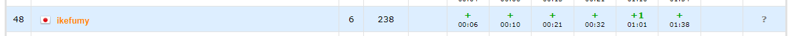

## 結果
丁度キーボードが届いた日のコンテストだったので、US配列に慣れる良い機会だと思って参加した。



思ったより出来たので満足。
EFあたりが「これマルチケースなんですか…？」って感じの問題で実装が結構苦しかった。

[コンテストのURL](https://codeforces.com/contest/1795/my)

## 振り返り

### A

図があるな～と思いながら読んでた。一方の文字列の上から取った連続部分列をリバースして他方の文字列にくっつける操作しか出来ないことを確認して、`s`と`t`をリバースした物をくっつけて`RR`, `BB`の個数を数えた。もしも1つだけならそこで区切ればよいが、2つあったらどう分けても同じ色が隣接する部分が出てくるのでダメ。

思ったよりスムーズに考察出来た気がしたがACまで6分強かかっててびっくりした。

### B

制約小さいからごり押し探索でもやるのかな？と思って考察してみたけど、これ $l_i=k$ を満たすような $i$ と $r_j=k$ を満たすような $j$ があればよくない？となり、提出してAC。あんまり制約小さいのが生きなかったので不安だったが、ひっかけみたいなもんだと思うことにした。

### C

図の意味がよくわからなかったのでスルーした。おもったより難しくて焦った。前から見て行って「今どんな量の飲み物が残っているか」がうまく管理できればいいよねって感じがしたので、その方針を考えてみる。$i$ 番目の人について考えているとき、残っている飲み物それぞれから $b_i$ を引く必要があり、この処理で $0$ を下回る飲み物には特別な処理が必要になりそう。全体から同じ数引くのは無理なので下駄を履かせて`priority_queue`で常勝！って感じになる。

考察が終わってみると大典型だった。

### D

今回の問題の中で一番素朴だと思った。うまく配置すれば各トライアングル内で2本の辺を使うことができる。このとき、赤2つ青1つのトライアングルが $n/6$ 個、赤1つ青2つのトライアングルが $n/6$ 個となるのでトライアングルごとの塗り分け方は $\displaystyle \binom{n/3}{n/6}$ 通りとなる。トライアングル内の色の塗り方は

1. すべて同じ重さ → 3通り
2. 重さが2種類で重い方が2つ → 1通り
3. 重さが2種類で軽い方が2つ → 2通り
4. 重さが3種類 → 1通り

となるので、あとは全部掛け合わせて終わり。

D解き終わって問題一覧に戻るとEFGのAC人数がG > F > Eの順番になってて、どれから解けばいいんだ…？となった。とりあえずE開いたら問題文が長かったのでFG解いてる人は問題文長いから後回しにしたんだろうと考え、順番通りEを解くことにした。

### E

読むのだるかったが読んだ。爆発に必要なマナが増えるほどbasic spellの詠唱回数が減るから三分探索でもすんのかな？って思った。三分探索するとしたら結局爆破する位置によってbasic spellを何回唱えるか数える必要があるからこっち先に考えるか～という気分になる。

ある位置で爆破を起こした時、左を全消しするのに必要なマナと右を全消しするのに必要なマナが分かればよさそう。対称性があるので左を全消しにする場合だけ考える。昇順で見ていって $i$ 番目を考えているとき、「$i-1$番目を爆破したときに左を全消しするのに必要なコスト」からうまいこと計算出来ればいいなぁという気分になる。$h_{i-1} < h_{i}$ のときはそのまま引き継げばよいが、そうでない時は少し面倒。$h_{i-1}$ を $h_{i} - 1$ まで削る必要がある。さらに、これによって $h_{i-2}$ が爆破できるかも変わってきてしまう。どうしましょう…ってなって途方に暮れる。よく考えるとヘルスの差がずっと1の区間は先頭が削られたら後続も同じ分だけ減らさないといけない。よってこの処理はまとめられる。つまり連続してる区間を保存しておいて順番に見ていけば良く、これをやるにはstackが都合がいい。計算量を考えると、$i$ 番目を見ているとき、区間 $[i, i]$が追加されたと考える。これを元にstackの先頭を見て、削る必要があればpopして削り現在の区間に加える。削らなくてよいなら終了。と処理すれば追加された区間たちは高々1回popするだけで、popしない場合は各処理で一回ずつなので償却で $O(N)$ となる。

実装するときは左を全消しするのに必要なコストを計算する関数を用意するとリバースしたやつ突っ込んで右も計算できるので楽。

コンテスト本番はこんなの書いてたけど、ちょくちょく無駄があります。
```cpp
vector<ll> calc(vector<ll> v) {
    int n = v.size();
    stack<pll> st;
    st.push({v[0], v[0]});
    vector<ll> ret(n, 0);
    rep(i, 1, n) {
        ret[i] = ret[i - 1];
        ll lw = v[i], hi = v[i];
        while (!st.empty()) {
            auto [l, h] = st.top();
            if (h < lw) break;
            st.pop();
            ret[i] += (l + h) * (h - l + 1) / 2;
            ll nlw = max(0ll, lw - h + l - 1);
            if (lw) ret[i] -= (lw - 1 + nlw) * (lw - nlw) / 2;
            lw = nlw;
        }
        st.push({lw, hi});
    }
    return ret;
}
```


あとは三分探索するだけや！と思い、三分探索を書き始めそうになったが、まずbasic spellに狭義の単調性があるのか分からないし、そもそも三分探索しなくてもそれぞれの地点で爆破起こした時の最小コスト分かるじゃんとなった。たまたま方針が死ななかっただけなので、運が良かった。いざ提出していみるとWAが出てしまい、結構メンタルにきた。バグりそうな部分はわりとちゃんと確認してから提出したつもりだったのでどこでWAが起きたか見当がつかなかった。丁寧に確認したのは部分和とるとこなので、そこ以外を確認すると`long long`であってほしい所が `int`になっていた。そこを直したらACになった。これでペナついたのしょうもなさ過ぎて悲しくなった。

### F

最初チップが移動したら移動前の頂点は白色に戻ると思い込んでたけど、そんなことは無いらしい。ようはある頂点を端点とするパスを出来るだけ並列して沢山伸ばしたいってことっぽい。シミュレーションしてくのは流石に無理でしょって感じがした(衝突した時に伸ばしなおすんだろうけどどこに伸ばすかの宛てが無いのでむりそう)ので、どうにかしてパスの長さを決め打つことにした。最大と書いてあるので二分探索やね、となり二分探索してそれぞれのパスの長さを固定した。そうすると後は木DPをするだけで良い。
1. 子からパスは伸びてきているか
2. 子孫のうち、使えるパスの最大長はどれくらいか

を考慮して衝突した場合などをうまく処理してAC。実装に結構手こずった。というか考察があまい状態で実装を始めたので場合分けやDFSでの戻り値をどうするかなどで時間を食ってしまった。

### G

この時点で残り22分だったので、「さすがにACまでは無理だな…」と思いつつとりあえず問題文を読んだ。これ全消し出来ない場合はどうするの？と思ったが、

> **Additional constraint on the input: there always exists at least one valid sequence of removals.**

と書いてあったので考えなくて良いらしい。この条件から現在除外可能な頂点は隣り合うことがなくて、貪欲に取っていくことで除去する頂点の順番を表すDAGが出来るので、あとは各頂点に関して「自分からは到達できないし、相手からも到達できない」ような頂点を数え上げれば良さそうだと思った。これ、頭が回ってなくてDFSで出来ると思ってたけど全然できない。本番はDFS全力で書いていたら時間切れになってしまった。

今のところbitset使うくらいしか思いつかない。

## 感想
全体的におおまかな解法は結構すぐ浮かんだが、細部を考えずに突き進んだせいで実装でわちゃわちゃしてしまった。これは細部に嘘があった場合死ぬのであまり良くない。次回はしっかり詰めてから実装したい。JIS配列では書きやすかった記法がUS配列では指の動きが多くて大変ということが結構あったので、キーボードを変えるとコードの書き方も変わるようになるのかなと思った。あとEFは関数を多用したくて、そうなるとグローバル変数として全部置くのが楽なんだけどマルチケースなので初期化が必要になり、めんどいな…という気分になった。ラムダ式に感謝。

最近のDiv2、毎回全完一歩手前で終わっちゃう。一回くらい全完してみたい。

## upsolve

そのうちやります。