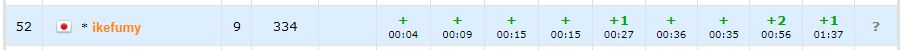

## 結果



ペナ多すぎ。

[コンテストのURL](https://codeforces.com/contest/1800/my)

## 振り返り

### A

ただの足し算みたいな問題が来ると思ってたら思ってたより面倒な問題が来た。色々考えたが、まずは文字列 $s$ の要素を全て小文字にして`s.erase(unique(s.begin(), s.end()), s.end())`でランレングス圧縮して、`s == "meow"`を見ることにした。これを書いてAC。

### B

それぞれのアルファベットにおいて、小文字の数と大文字の数を数えておく。アルファベット $i$ における小文字の数を $small_i$, 大文字の数を $large_i$ として、答えに $\min(small_i, large_i)$ を足した後、$\min(k, |small_i, large_i| / 2)$ を答えに足す。またこの値を $k$ から引く。とやればいいだけ。

### C1

なんか適当にDPするんでしょう、って感じだったが、面倒そうなのでC2解いてからその提出をC1になげればいいか、と考えC2に向かった。

### C2

配列を左から走査し、$a_i>0$ なら`priority_queue`に降順でつめこみ、`0`なら`priority_queue`の先頭を答えに加算してポップする。ポップしたやつが前回の奴より後の要素だったとしたら前回の奴と自分の取ったカードを逆に取ったと考えるようにすればよい。一応C2のACを確認してからC1に投げた。

### D

よくわからないからロリハを持ち出した。文字列を繋げるのに苦戦しつつ提出したらWAがでて「デバッグ嫌すぎ...」ってなった。いろいろ入れてみて最終的に、ハッシュ値を詰め込む`set`が`int`型で定義されているせいだった。これを`long long`に直してAC。

### E1

$k=3$とか関係なしに互いにswapで到達できうる頂点集合ごとに分けて、この頂点集合の値を添え字とする $s$, $t$ のアルファベットの多重集合が等しければいいのでは？と思った。$k=3$ だから使える解法ってのがパッと浮かばなかったが、ひとまずE2みて、それのACコードをE1に投げることにしてE2に向かった。

### E2
問題文を読んだが、E1で書いた考察で間違いなさそう。BFSなどで先ほどの考察を実装しAC。

### F
結構悩んだ。最初は「どのアルファベットが存在するか」と「奇数個あるアルファベットであるか」をbitで表して上手い事処理するのかと考えたが、無理そう。OKとなるのは二つの文字列の「奇数個あるアルファベット」の値をxorしたものpopcountが25であるときで、このとき必ず文字列の長さは奇数になっている。ここで、bitの値が`0`のアルファベットは存在しないからOKか！という謎の勘違いをしたため1WA。よく考えたらそんなことは無いので、`map`を26個つくって、$i$ 個目の`map`には「 $i$ 番目のアルファベットが存在しない文字列のbit表現の値」を入れておく。あとはそれぞれの文字列についてどのアルファベットを使わないかを全探索して、適切な`map`から値を取り出して答えに加算すれば良い。これ書いて出したらTLEした。`map`はアクセスしたときにそのキーが存在しなかったら勝手に作ってしまうので、そのせいでサイズがでかくなりTLEしてるっぽい。場合分けしてキーが存在しない時はアクセスしないようにしてAC。

### G
ひとまずうまく探索する方法を考えたが、特に浮かばない。そういえば木のハッシュという物を聞いたことがあるな～と思い、検索したら[この記事](https://snuke.hatenablog.com/entry/2017/02/03/054210)を見つけた。ロリハライブラリからハッシュ計算だけ抜き出してこれに書いてある通りに木のハッシュを実装し、根から順番に子のハッシュを列挙し、奇数個あるハッシュ値が0個ならその時点で終了。1個ならそのハッシュ値を持っている子のうちの1つに遷移、2個以上なら答えを`NO`として終了、という実装をした。これを提出したらWAがでた。木のハッシュの実装ミスを疑い確認したが特にミスはない。いろいろテストケースを入れてたら以下のケースが`YES`と判定された。
```txt
4
1 2
1 3
3 4
```
ハッシュを用いて対称かを判定する段階で「奇数個あるハッシュ値が2個以上」の部分の等号が抜けており、「奇数個あるハッシュの値が2個より多いとき」になっていた。これに等号をつけてAC。

## 感想
問題文が難読だった。あと思っていたより難しかったので焦った。この難易度でもケアレスミスでペナ出しまくったので若干悲しい。G問題で初めて木のハッシュの実装を知ったんだけど、これでちゃんとしたハッシュになるのすごくて感動した。暇なときにちゃんと勉強したい。

## upsolve

システスでFが落ちた。流石にmap26本はダメらしい。なのでFのupsolveをする。

### F
考察し直して計算量改善を目指したが、無理そう。とりあえずTLEしたコードを見てみる。`map<int, ll>`という部分があったので`map<int, int>`に変更して提出してみる。ACした。「おもんな」となった。確かにここは`long long`である必要が無いので、そこを辺に勘ぐって`long long`にしたのがダメなんだけど、これで落される問題はつまらないだろって感じがした。一応解説見たけど解法同じだし計算量も同じだった。