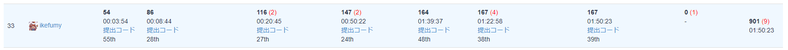
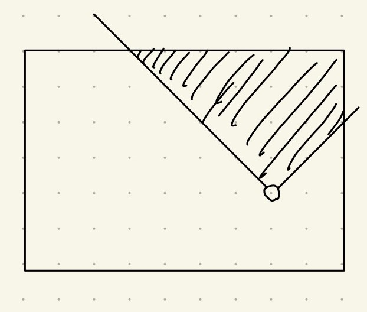

## 結果

初めてyukicoderのコンテストに参加した。

7完で33位だった。ペナ9個もあってすごい。

[コンテストのURL](https://yukicoder.me/contests/420)

## 振り返り

### A

問題文の通り場合分けして実装するだけ。`atoi`を使おうとしてそのまま`string`型の変数入れたら怒られた。`char *`型しか許してくれないらしい。`.c_str`を使い事なきを得た。
### B
これも問題文の通りに実装するだけ。愚直に書くと $O(HWK)$ だけど、制約が制約なので間に合う。
### C
嘘生やしまくった。最初は先頭から愚直にマッチングしていって`helloworld`を埋め込める場所を見つけたら残りの部分に`a`を埋め込めば良いと思ったが、WA。よく考えたら後ろからじゃね？と思い後ろからマッチングしてみたけどWA。もっとよく考えるともともと`helloworld`が埋め込まれているのなら全ての`?`を`a`で置換するのが最適...？と考えたがこれが嘘でまたWAが出たら流石に苦しいので愚直に全通り試してソートして一番小さいやつを出力した。
### D
これは実装ミスでWAを生やしていた。横パンチの回数を固定して縦パンチの回数を二分探索すればよさそうなのは割とすぐわかって実装したらWAがでた。最初は考察が違うのかと思って考察し直そうとしたが、特にヤバそうな点がなかったので次に実装ミスを探すことにした。オーバーフローとか二分探索の上限下限当たりを調べたけど特に問題無さそうだった。ここでもう一回考察ミスを考えなおした。横パンチの回数は最大でも $H$ 回だと思ってたけど、そうでもなくて $H+W$ 回が上限やん、と気づき、書き直して提出したがまだWAだった。いよいよなんでWAなのか分からなくてしばらく絶望してた。

何回も確認した末、制約を見誤ってることに気づいた。 $0 \leq K_A, K_B \leq HW$ なので $K_A, K_B$ は最大で $10^{12}$ になるんだけど、なぜか $10^6$ が最大だと思ってた。ここが原因でWAが出ていたのでそこを書き直してやっとACした。
### E

AC数がFの方が多かったのでF解いてからEを解いた。手元で色々かいて良さげな方法を探した。途中から周期的な動きをしてくれると嬉しいな～と思いながら色々実験した結果、`DDDRRRRU`のあとは外周をクルクルまわる感じで対処出来る事に気が付いた。つまり`UULL`, `LLDD`, `DDRR`, `RRUU`, `UULL`, ...と繰り返せば良い。これをそのまま実装してACした。
### F

これも誤読でめっちゃWAを生やした。まず条件式から「こんなん45度回転ですやん」って気持ちになる。制約を見間違え $HW \leq 2 \times 10^5$ だと思っていたので行方向に走査してセグ木で管理する感じか～となる。これ書いて提出したらMLEでて仰天した。とりあえずセグ木に投げるクエリの保存方法を変えたりセグ木ではなくFenwick treeを使ってみたり、`mint`ではなく`long long`を使ってみたりしたがすべてMLE。よくわかんなくなって結構絶望した。いろいろ考えた後制約見直したら$HW \leq 2 \times 10^5$ じゃなくて目を疑った。 $\max(HW, 2 \times 10 ^ 5)$ の部分でとなり合ってる要素を都合よく解釈してたのバカすぎて面白い。この制約でも上手い事やれば今の方針でいけるのかな～と思ってちょっと考えたけど、面倒なことになりそうだったので方針を変えた。宝の数が高々 $2 \times 10 ^ 5$ 個なので主客転倒してそれぞれの宝についてその宝をゲットできるマスの数を数え上げることにした。これは下図のようになる。

最初はこれを愚直に数えようと思ってたけど面倒なのでもうちょっと楽な方法を考えた。一旦長方形部分を全て足し、後から余分な部分(三角形か台形になる)を引けば楽そうだと思い、この方針で実装した。なんかWAがでてビックリした。確認したらオーバーフローしてたので`long long`を使い、やっとAC。
### G

良い知らせがあるマスを通る回数を最大化すれば良い。列方向に走査してセグ木に行の情報をもつ。各行においてその行における良い知らせのマスを通る回数の最大値を求めておいて各列の良い知らせがあるマスについて適宜更新する。これ書いてAC。これが一番典型っぽくてやりやすい気がした。
### H

のこり10分だったので急いで考えた。Cでの考察を利用して、Z-algorithmを改造すればOK!と思い全力で書いて提出したがダメだった。
## 感想

ペナが多すぎて笑った。問題文と制約を雑にみすぎてる。コンテストの仕組みを大して理解してないけどペナは多分出さない方がいい。初めてyukicoderのコンテストに参加したけど結構面白かった。次はなるべくペナを出さないようにしたい。

## upsolve
そのうちやります。