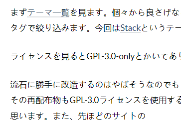

== 概要

HUGOとGitHub Pagesを利用して作りました。最初はjekyllで作っていたんですが、MathJaxが強制だったり(KaTeXを使いたい)選べるテーマが少なかったりする部分がイマイチだなぁと感じてました。あとこれは僕の技術力不足だと思うのですがWSL2を用いてプレビューする際minima以外のテーマを使うとエラーを吐かれたのでとりあえずminimaを使ってました。プラグイン周りの調べ物をしてたら「HUGO+GitHub Pagesでホームページを作った」みたいな記事を見つけ、「HUGO使えるの！？」となり、乗り換える事にしました。

== Hugo+GitHub Pagesのやり方
https://gohugo.io/hosting-and-deployment/hosting-on-github/[Host on GitHub | Hugo] に案内があるので、それに従って環境構築したりGitHub Actionsの設定をしたりしました。ただ、 `.github/workflows/gh-pages.yml` をそのままコピペしたらDeployのステップでpermission deniedと言われたので、 https://github.com/peaceiris/actions-gh-pages#%EF%B8%8F-first-deployment-with-github_token[このページ] を参考に
```yml
    permissions:
      contents: write
```
を追記したら動きました。また、 `resources` ディレクトリはキャッシュを貯めている場所らしいので消して良いと思い消したところ、GitHub Actionsのbuildでエラーが発生しました。エラーを読むと「 `sass` ファイルはextendバージョンがいるよ」と書いてあったので `gh-pages.yml` を以下のように書き換えました。
```yml
        with:
          hugo-version: 'latest'
          extended: true
```

== ブログの構成

ここらへんで「jekyllである程度の物作れたのにHUGOを一からやり直すのだるくね？」という気分になってきました。KaTeXを使うために頑張ります。jekyllのままでも使えるんですが、回りくどい方法になりそうです。なんなら自分でGitHub Actionsを作って変換されないようにすればいいんじゃないかという気がしてきたんですが、できるかわからないのでとりあえずHUGOでやっています。

好きなテーマを選び、それを改造していくという手段を取ります。あとPrism.jsをいれてそれを改造します。そのままでもいい気がしてきましたが、改造します。

=== テーマ
まず https://themes.gohugo.io/[テーマ一覧] を見ます。ここから良さげなものを探し出して改造するんですが、レスポンシブデザインに対応しててほしいのでタグで絞り込みます。今回は https://themes.gohugo.io/themes/hugo-theme-stack/[Stack] というテーマをベースにデザインすることにしました。

ライセンスを見るとGPL-3.0-onlyとかいてあり、知らなかったので調べました。分かりませんでした。いかがでしたか？

流石に勝手に改造するのはやばそうなのでもうちょっと頑張って調べた結果、改造はOK。再配布もOK。しかし再配布する場合はその再配布物もGPL-3.0ライセンスを使用する必要があるっぽいことが分かりました。ChatGPTもそういっていたので大丈夫だと思います。また、先ほどのサイトに

> Please do not remove the “Theme Stack designed by Jimmy” text and link.

と書いてありました。フッターに書いてあるので、これを消さないようにしておけば良さそうです。 ~~quick startのanankeと同じ要領で配置したりymlを書き換えたりします。~~ そのままsubmobule化すると `hugo-theme-stack` をいじったときに本家にpushする羽目になるので、 **cloneするかforkしてforkしたものをsubmoduleしてください。** 僕はsubmoduleが何かわからずいじっていたせいで面倒なことになりました。本家から `submodule` して差分を `root` ディレクトリに配置する方がいい気がするんですが、面倒なのでforkしてしまいました。

さて、いざページを表示したらフォントが中国語っぽくなってしまいました。



直します。デベロッパーツールで文字をクリックして元のfont-familyを探すと、以下のような部分を発見しました。

```css
:root {
    --sys-font-family: -apple-system, BlinkMacSystemFont, "Segoe UI", "Droid Sans", "Helvetica Neue";
    --zh-font-family: "PingFang SC", "Hiragino Sans GB", "Droid Sans Fallback", "Microsoft YaHei";
    --base-font-family: "Lato", var(--sys-font-family), var(--zh-font-family), sans-serif;
    --code-font-family: Menlo, Monaco, Consolas, "Courier New", monospace
}
```

これを書き換えれば良さそなので `grep` でしらべたところ、 `./themes/hugo-theme-stack/assets/scss/variables.scss` にあったのでこれを以下のように書き換えました。

[source, diff-css]
....
:root {
    --sys-font-family: -apple-system, BlinkMacSystemFont, "Segoe UI", "Droid Sans", "Helvetica Neue";
-    --zh-font-family: "PingFang SC", "Hiragino Sans GB", "Droid Sans Fallback", "Microsoft YaHei";
-    --base-font-family: "Lato", var(--sys-font-family), var(--zh-font-family), sans-serif;
+    --base-font-family: "Lato", var(--sys-font-family), sans-serif;
    --code-font-family: Menlo, Monaco, Consolas, "Courier New", monospace;
}
....
これで文字はひとまず直りました。良さげなフォントがあったら適宜弄りたいと思います。 `config.toml` でフォントを指定したCSSを読み込むなどの方法もあるらしいのですが、いたるところで `--base-font-family` が使われていたので、ここを書き換えるのが一番手っ取り早いんじゃないかと思いました。